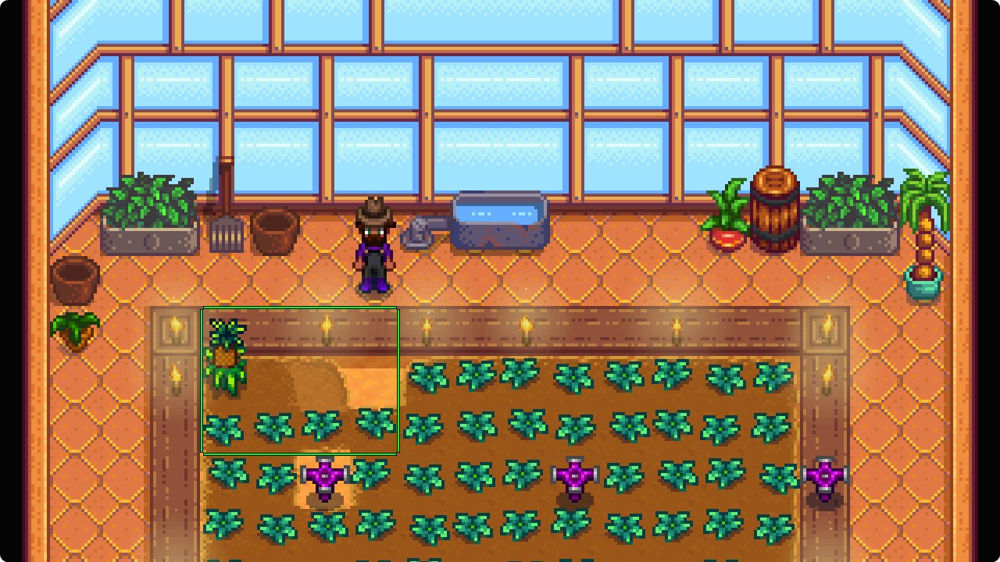
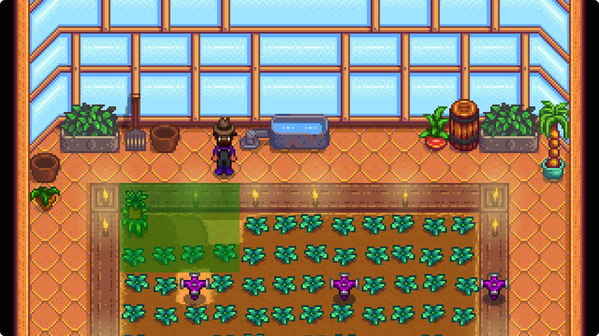
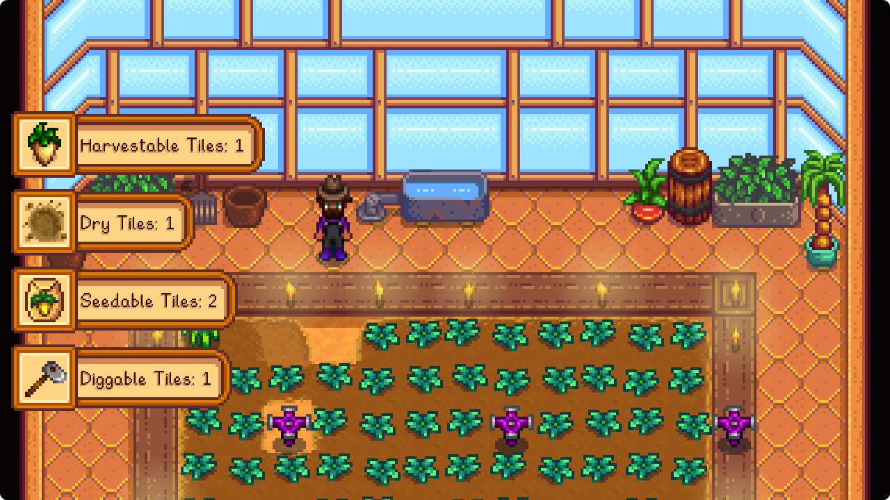

# Tile Counter
Tile Counter is a Stardew Valley mod that counts tiles with specific properties in a selected area.

[Nexus Page](https://www.nexusmods.com/stardewvalley/mods/35853)

## Installation
1. Install [SMAPI](https://smapi.io)
2. Download the mod from [Releases](https://github.com/FawazTakahji/StardewTileCounter/releases)
3. Download [GMCM](https://www.nexusmods.com/stardewvalley/mods/5098) if you want to edit the mod settings

## Features
- Gamepad support
- Count all selected tiles
- Count all tiles with fully grown crops
- Count all digged tiles that need watering
- Count all digged tiles that don't have a crop
- Count all tiles that can be digged

## Controls
| Keybind | Keyboard | Xbox Gamepad | Playstation Gamepad |
| :-: | :-: | :-: | :-: |
| Scan Current Location | Ctrl + V | Y + DPad Right | Triangle + DPad Right |
| Toggle Selection Mode | Ctrl + C | Y + DPad Up | Triangle + DPad Up |
| Select Tile | Mouse Left Click | A | Cross |


## Screenshots
<details>
  <summary>Border</summary>

  
</details>
<details>
  <summary>Simple Border</summary>

  
</details>
<details>
  <summary>Notification</summary>

  
</details>

## Building
The mod build package should be able to locate your game folder automatically, if it cant find it or if you want to specify it manually, edit the csproj file like so:
```xml
<PropertyGroup>
    ...
    <GamePath>Your Game Path</GamePath>
    ...
</PropertyGroup>
```
If you want to set this path for all projects, create a file called `stardewvalley.targets` in your home folder (`%userprofile%` | `~`) and add the following:
```xml
<Project>
   <PropertyGroup>
      <GamePath>Your Game Path</GamePath>
   </PropertyGroup>
</Project>
```

You should now be able to build and debug the mod using your IDE
